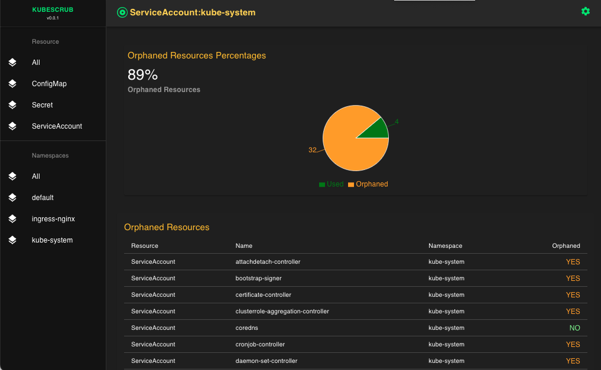
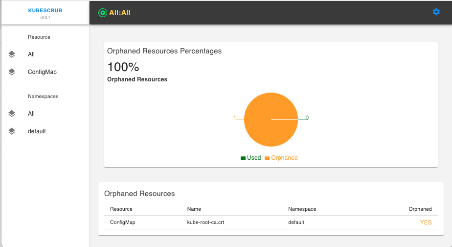
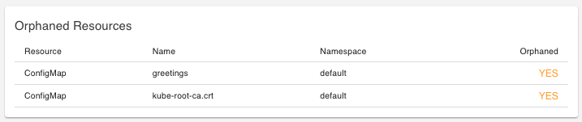
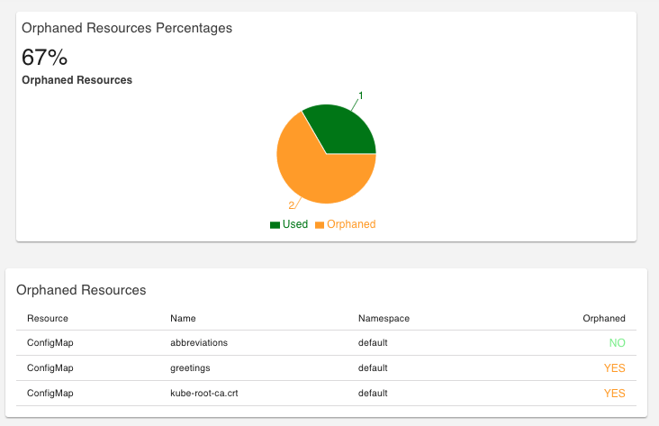

# Kubescrub Operator

**Video Demo**  
[](https://youtu.be/AmrmLz01NJM?t=5)  
  
Kubernetes is a powerful and versatile container orchestration platform that allows organizations to deploy, manage, and scale containerized applications with ease. However, as Kubernetes environments grow in complexity, it can become challenging to keep track of all the resources being used and to ensure that none of them are orphaned or left unused. This is where the Kubescrub app comes in handy.

Kubescrub is an intelligent application that makes educated predictions about whether resources in a Kubernetes cluster are orphaned or not. With its highly configurable nature, Kubescrub can be tailored to meet the specific needs of an individual or organization. Users can choose the theme, polling options, polling intervals, and specify which resources and namespaces to watch.

_This operator deploys the kubescrub application (written last week over a few days), consisting of a React frontend and a Go backend. See the [usage](#usage) section for configuration options._

This operator installs and deploys:

- NGINX Ingress Depedencies
- Kubescrub Operator Dependencies
- Ingress (NGINX)
- Frontend Deployment
- Backend Deployment
- Frontend Service
- Backend Service
- Service Account for backend (Needs permissions to look at resources)
- ClusterRole for SA
- ClusterRoleBinding for SA

**TOC**

- [Usage](#usage)
- [Prereqs](#prereqs)
- [Tutorial](#tutorial)
- [Sites](#sites)
- [Clean Up](#clean-up)

## Usage

| Name                                                                                                                                 | Type   | Description                                                   | Values                                 | Optional                                               |
| ------------------------------------------------------------------------------------------------------------------------------------ | ------ | ------------------------------------------------------------- | -------------------------------------- | ------------------------------------------------------ |
| [Poll](https://github.com/cmwylie19/KubeScrub/blob/4ce1dc3723f53d693227595a2f1c3b4507d5e88b/server/cmd/kubescrub/server.go#L35)         | string | Frontend polls backend for updates                            | "true", "false"                        | true, default to false                                 |
| [PollInterval](https://github.com/cmwylie19/KubeScrub/blob/4ce1dc3723f53d693227595a2f1c3b4507d5e88b/server/cmd/kubescrub/server.go#L36) | string | Interval that frontend queries backend for updates in seconds | "5", "60"                              | true, defaults to 60 seconds                           |
| [Namespaces](https://github.com/cmwylie19/KubeScrub/blob/4ce1dc3723f53d693227595a2f1c3b4507d5e88b/server/cmd/kubescrub/server.go#L37)   | string | Namespaces to watch for orphaned resources                    | "default, kube-system, kube-public"    | true, defaults "kybe-system, default"                  |
| [Resources](https://github.com/cmwylie19/KubeScrub/blob/4ce1dc3723f53d693227595a2f1c3b4507d5e88b/server/cmd/kubescrub/server.go#L39)    | string | types of resources to watch                                   | "ConfigMaps, ServiceAccounts, Secrets" | true, defaults to ConfigMaps, ServiceAccounts, Secrets |
| [Theme](https://github.com/cmwylie19/KubeScrub/blob/4ce1dc3723f53d693227595a2f1c3b4507d5e88b/server/cmd/kubescrub/server.go#L38)        | string | Dark or light theme for the frontend                          | "dark", "light"                        | "dark" (defaults to dark)                              |

## Prereqs

_You need [Kind](https://kind.sigs.k8s.io/) to run this demo_. We will configure the kind cluster to map containerPort 31469 to hostPort 8080, which means we can use port 8080 of our laptop to access 31469 in the cluster. All communication and routing is done through the Kubernetes Ingress. Port 31469 is the nodePort of the `ingress-nginx-controller` service. The operator deploys NGINX Ingress depedencies at install time through a **[Job](https://github.com/cmwylie19/kubescrub-operator/blob/main/config/manager/manager.yaml#L762) and deploys ingress resources at runtime in the reconcile loop.

**The raw manifests for the NGINX Ingress controller are mounted in a [configmap](https://github.com/cmwylie19/kubescrub-operator/blob/main/config/manager/manager.yaml#L108) fromFile. The configmap is mounted as a [volume](https://github.com/cmwylie19/kubescrub-operator/blob/main/config/manager/manager.yaml#L772) in the job. The job does a `kubectl create/apply -f`. This is a prereq to install the `nginx` ingressClass

## Tutorial

_In this tutorial, we will deploy the Kubescrub operator and demonstrate the usage/configurations of the Kubescrub application._

Spin up the kind cluster:

```bash
cat <<EOF | kind create cluster --name=demo --config=-
kind: Cluster
apiVersion: kind.x-k8s.io/v1alpha4
nodes:
- role: control-plane
  kubeadmConfigPatches:
  - |
    kind: InitConfiguration
    nodeRegistration:
      kubeletExtraArgs:
        node-labels: "ingress-ready=true"
  extraPortMappings:
  - containerPort: 31469 #NodePort of NGINX service
    hostPort: 8080
    protocol: TCP
EOF
```

_This will deploy the kubescrub operator and all of the depedencies, which include NGINX Ingress dependencies._

```bash
make deploy
```

Wait for the operator's controller-manager and the NGINX controller to become ready:

```bash
kubectl wait --for=condition=Ready pod -l control-plane=controller-manager -n kubescrub-operator-system --timeout=180s

kubectl wait --for=condition=Ready pod -l app.kubernetes.io/component=controller -n ingress-nginx --timeout=180s
```

Notice the ingress service is exposed as type `NodePort` on NodePort `31469` (so we can get to the ingress through localhost:8080):

```bash
kubectl get svc/ingress-nginx-controller -n ingress-nginx -o 'custom-columns=PORT:.spec.ports[0].nodePort,TYPE:.spec.type'
```

output

```bash
PORT    TYPE
31469   NodePort
```

Set the context to the `kubescrub-operator-system` namespace

```bash
kubectl config set-context $(kubectl config current-context) --namespace=kubescrub-operator-system
```

Create an instance of the `Kubescrub` operator running the `dark` theme, looking for `ConfigMaps, ServiceAccounts, and Secrets` in namespaces `default, ingress-nginx, and kube-system` that is polling for updates every 5 seconds.

```bash
kubectl create -f -<<EOF
apiVersion: infra.caseywylie.io/v1alpha1
kind: Reaper
metadata:
  labels:
    app.kubernetes.io/name: reaper
    app.kubernetes.io/instance: carolina
  name: carolina
spec:
  theme: dark
  resources: "ConfigMap,Secret,ServiceAccount"
  namespaces: "default,ingress-nginx,kube-system"
  poll: "true"
  pollInterval: "5"
EOF
```

Wait for the application to become ready:

```bash
kubectl wait --for=condition=Ready pod -l kubescrub_cr=carolina --timeout=180s
kubectl wait --for=condition=Ready pod -l kubescrub_cr=carolina-web --timeout=180s
```

Go to [localhost:8080](http://localhost:8080) and you can see the frontend in action


Let's checkout the ingress that the operator deployed.

```bash
kubectl get ing kubescrub -oyaml
```

output

```yaml
apiVersion: networking.k8s.io/v1
kind: Ingress
metadata:
  creationTimestamp: "2023-03-18T12:59:39Z"
  generation: 1
  labels:
    app: kubescrub
    kubescrub_cr: carolina
  name: kubescrub
  namespace: kubescrub-operator-system
  ownerReferences:
  - apiVersion: infra.caseywylie.io/v1alpha1
    blockOwnerDeletion: true
    controller: true
    kind: Reaper
    name: carolina
    uid: 1d50f86d-f4b8-45ea-87ee-8547f596092d
  resourceVersion: "3865"
  uid: fd2a824a-67cc-4e99-a0c3-f26a4e42ef8b
spec:
  ingressClassName: nginx
  rules:
  - http:
      paths:
      - backend:
          service:
            name: kubescrub
            port:
              number: 8080
        path: /scrub
        pathType: Prefix
      - backend:
          service:
            name: kubescrub-web
            port:
              number: 8080
        path: /
        pathType: Prefix
status:
  loadBalancer:
    ingress:
    - ip: 10.96.75.29
```

Look how the operator configured the kubescrub configuration in the deployment

```bash
k get deploy kubescrub -ojsonpath='{.spec.template.spec.containers[0].command}' | jq 
```

output

```json
[
  "./kubescrub",
  "serve",
  "-p",
  "8080",
  "--theme",
  "dark",
  "--watch",
  "ConfigMap,Secret,ServiceAccount",
  "--namespaces",
  "default,ingress-nginx,kube-system",
  "--poll",
  "true",
  "--poll-interval",
  "5"
]
```

Let's delete this instance and create a new instance only watching ConfigMaps in the default namespace with the light theme

```bash
k delete reaper carolina
kubectl create -f -<<EOF
apiVersion: infra.caseywylie.io/v1alpha1
kind: Reaper
metadata:
  labels:
    app.kubernetes.io/name: reaper
    app.kubernetes.io/instance: carolina
  name: carolina
spec:
  theme: light
  resources: "ConfigMap"
  namespaces: "default"
  poll: "true"
  pollInterval: "5"
EOF
sleep 9
kubectl wait --for=condition=Ready pod -l kubescrub_cr=carolina --timeout=180s
kubectl wait --for=condition=Ready pod -l kubescrub_cr=carolina-web --timeout=180s
```

Go to [localhost:8080](http://localhost:8080) and you can see the frontend in action


Since we have configured the application to poll, let's test the application by deploying 2 configmaps, one orphaned and one bound to a pod.

Create orphaned configmap

```bash
kubectl create cm greetings --from-literal=hey=you -n default
```



Used configmap

```bash
kubectl create cm abbreviations --from-literal=NC='North Carolina' -n default
kubectl apply -f -<<EOF
apiVersion: v1
kind: Pod
metadata:
  creationTimestamp: null
  labels:
    run: states
  name: states
  namespace: default
spec:
  containers:
  - image: nginx
    name: greeter
    env:
    - name: "NAME"
      valueFrom:
        configMapKeyRef:
          key: NC
          name: abbreviations
    resources: {}
  dnsPolicy: ClusterFirst
  restartPolicy: Never
EOF
```



This app itself is not 100% accurate. It makes educated guesses based on if the name of the resources and type of resource exists in the pod definitions. Time was the limiting factor. If I had more time i would have created interfaces and tests.

## Clean Up

Since this is just a kind cluster, we can delete the environment

```bash
kind delete cluster --name=demo
```

## Sites

- [NGINX Ingress](https://kubernetes.github.io/ingress-nginx/deploy/#quick-start)

[top](#kubescrub-operator)
